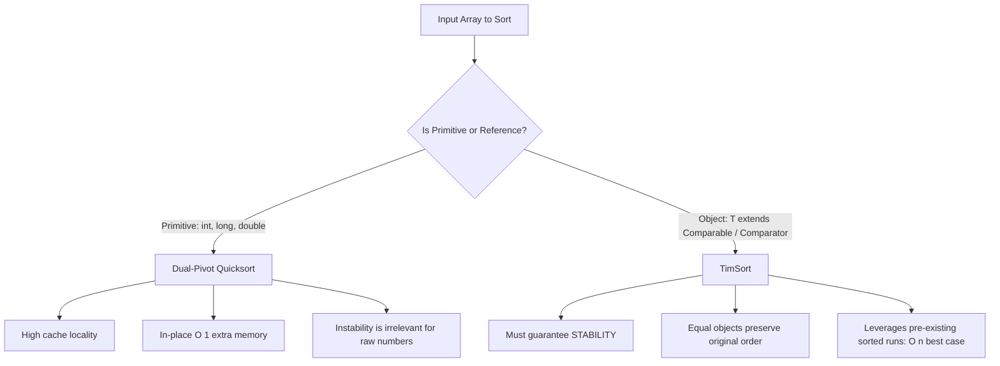

# Architecture — Sorting Basics

## Java Standard Library Sorting Architecture

```
java.util.Arrays
  ├── sort(int[]) / sort(primitive[])
  │     ├── Small arrays (< 47 elements): Insertion Sort
  │     ├── Medium/Large arrays (< 286 elements): Dual-Pivot Quicksort (Vladimir Yaroslavskiy et al.)
  │     └── Highly structured data (> 286 elements): Adaptive Run-Mergesort check
  ├── sort(Object[]) / sort(T[], Comparator)
  │     └── TimSort (hybrid MergeSort + Binary Insertion Sort, stable, O(n log n))
  └── parallelSort(int[]) / parallelSort(T[])
        └── ForkJoinPool-based parallel divide-and-conquer (threshold: 8192 elements)

java.util.Collections
  └── sort(List<T>, Comparator)
        └── Dumps to array -> Arrays.sort(T[], Comparator) -> Writes back using ListIterator
```

## Primitive vs Object Sorting Design Decision



## Memory & Cache Architecture

- **L1/L2 Cache Locality**: Sequential access patterns in cache lines (64 bytes). Primitive arrays (`int[]`) are contiguous in RAM.
- **Reference Indirection**: `Integer[]` stores 64-bit references pointing to heap memory addresses, inducing cache misses.
- **Branch Prediction**: Predictable comparisons in sorted runs yield high branch prediction accuracy (>98%).

## When to Build Custom Sorting

1. **Custom Comparison Topologies**: Multi-criteria sorting with domain short-circuits.
2. **External Sorting**: Datasets exceeding physical RAM using K-way merge with temp files.
3. **Low-Allocation Constraints**: Zero-garbage-collection algorithms for real-time finance and high-frequency trading (HFT).
4. **Specialized Key Distributions**: Non-comparison sorts like Radix Sort ($O(n \cdot k)$) or Counting Sort when key ranges are bounded.
